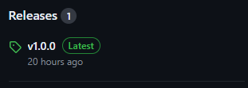

# U2L SCANNER

U2L 프로젝트에서 사용된 코드 스캐닝 기능은 GitHub를 통해서 서비스 되고 있으며 아래 링크를 방문하여 소스 코드 및 Release 된 바이너리 파일을 다운로드 받을 수 있다.

- [https://github.com/ustraframework/u2l-scanner](https://github.com/ustraframework/u2l-scanner)

바이너리 파일은 사이트 우축의 Release 영역에서 다운로드 받을 수 있다.



다운로드 받은 jar 파일은 실행 영역에 복사한다. 해당 파일은 JRE 1.6 이상이 필요하다.

만약 서버 정보 수집 용도로 사용한다면 파일을 서버에 복사해야 한다.

# 서버 정보 수집

서버 정보 수집은 collect 명령어를 사용하여 실행할 수 있다. 수집되는 서버 정보는 다음과 같다.

- 시스템 환경 변수 값
- Web/WAS 등 미들웨어 세팅 값 및 설정 파일
- 스케쥴링 등의 설정 정보

서버상에 jar 파일이 위치하는 경로에서 다음과 같은 명령어를 사용하여 서버 정보를 수집한다.

```bash
# /app 경로는 미들웨어가 위치하는 경로의 상위 디렉토리
java -jar ustra-u2l-scanner-1.0.1.jar collect -r /app
```

-r 인자 값은 스캔할 ROOT 경로를 지정한다. 서버에 존재하는 모든 경로를 검사할 경우 많은 시간이 소요되므로 위와 같이 ROOT 경로를 지정하여 실행시간을 단축할 수 있다. ROOT 경로는 여러 경로를 설정할 수 있으며 이 때는 “,” 문자로 경로를 구분한다.

```bash
java -jar ustra-u2l-scanner-1.0.0.jar collect -r /app,/app2
```

-e인자 값은 경로 중 제외할 경로를 설정할 수 있다. 스캔 중 대량의 파일이 위치하는 경로를 제외 처리하여 서버 정보 수집을 빠르게 진행하는 것이 가능하다.

```bash
java -jar ustra-u2l-scanner-1.0.0.jar collect -r /app,/app2 -e /app/images
```

-s인자 값은 탐색 중 Symbolic Link 경로는 제외하는 옵션이다.

```bash
java -jar ustra-u2l-scanner-1.0.0.jar collect -r /app,/app2 -s
```

위와 같은 명령어를 실행하면 다음 이미지와 같이 스캐너가 동작한다.


구동 계정에 따라 수집 내용은 달라질 수 있으므로 수집결과에 대한 디렉토리는 실행경로의 “호스트명” + “사용자명” 형태로 생성된다.


생성된 디렉토리로 이동하면 “server-env.csv” 파일이 존재하며 파일 내에 서버 환경 변수 및 주요 설정정보가 기입되어 있다.

WEB/WAS 설정 정보는 다음과 같은 종류의 Web/WAS를 지원한다.

| WEB | WAS |
| --- | --- |
| Apache | Tomcat |
| Nginx | Weblogic |
| OHS | Jeus |
| Webtob |  |

# 코드 분석

코드 분석은 소스 코드 상에서 지정된 파일 형식을 검사하며 U2L 전환 시 확인할 필요가 있는 코드 또는 변경이 필요한 영역의 코드를 검출하는 기능을 제공하며 analysis 키워드를 사용하여 구동할 수 있다.

```bash
java -jar ustra-u2l-scanner-1.0.1.jar analysis -r "/app/workspace/java-code" -t java
```

- -r : 코드를 검사할 소스 코드 경로를 지정
- -t : 검출 언어 유형 (java, c, xplatform)

위와 같은 명령어를 입력하면 다음과 같이 구동 로그가 표시된다.


소스 코드 검출은 다음과 같은 영역의 검출을 지원한다.

| 공통 사항 | Java | C | XPlatform |
| --- | --- | --- | --- |
| Oracle 버전 변경에 따른 미지원 쿼리 검출 | 플랫폼 의존성에 따른 확인이 필요한 코드 사항 | GCC 미지원 함수 및 헤더 include 검출 | XPlatform 전용 파일에 대한 검증 |
| URL 및 IP 주소 패턴 검출 | HTTP 헤더 파일 Writing 코드 | GCC 에서 변환이 권장되는 코드 영역 검출 |  |
| 호스트 명 사용 메소드 검출 | Socket, Http Client 등 인터페이스 관련 코드 | strncpy 등 NULL 문자를 사용하여 문자를 생성하는 코드 |  |
|  | TLS 버전 설정 |  |  |

검출 내용은 csv 파일로 생성되며 파일을 열면 검출된 내역을 확인할 수 있다.


모드 검출은 패턴에 의해 문제가 되거나 확인이 필요한 코드 라인 등이 포함되어 있으므로 전환 담당 개발자의 판단에 따라 수정 여부는 별도로 결정해야 한다.

# 코드 분석 결과 판단

코드 분석 결과는 단순 패턴을 확인하는 결과 값이지만 검출된 패턴 중에서 확인해야 할 사안은 다음과 같다.

- IP 주소 패턴 중 변경되는 대상 서버의 IP가 존재하는 경우
- URL 패턴 중 HTTP 연계가 존재할 경우, TO-BE에 해당 프로토콜을 지원하는지 여부
- HTTPS URL일 경우, TLS 버전 지원 범위 확인
- IP, URL이 개발, 운영계 정보가 Static 하게 설정되어 있을 경우 프로퍼티 전환 등을 통한 코드 개선
- GCC, Java Replace 권장 메소드의 치환